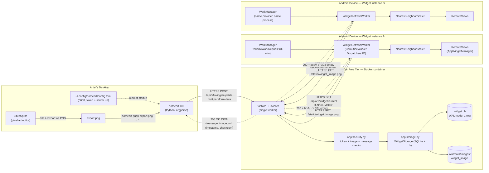
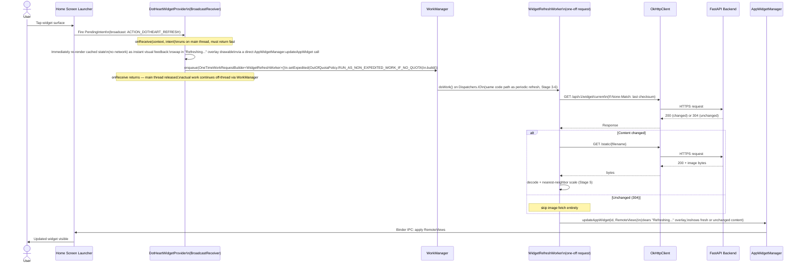

# DotHeart — WORKFLOW

This document describes how data actually moves through DotHeart, end to
end: from a pixel art file on disk to pixels rendered inside a
`RemoteViews` on an Android home screen. It complements `PLAN.md` (which
covers *what to build, phased, with acceptance criteria*) by documenting
*how the built system behaves* — the wire formats, thread/coroutine
context each step runs on, and the exact recovery path for every failure
mode.

Implementation status: the FastAPI backend (`app/`) is implemented and
covered here as built. The CLI and Android client are specified here to
the same level of precision as PLAN.md's Phase 2–4 design — code
references to files that don't exist yet are marked **(planned)**.

---

## 1. System Architecture Overview



**Note on the two widget instances**: both `PhoneA`/`PhoneB` boxes above
run inside the *same* Android app process, as two placed instances of the
single `DotHeartWidgetProvider`. They are drawn as separate subgraphs
because each has its own `appWidgetId` and receives its own
`RemoteViews.updateAppWidget` call, but they share one `WorkManager`
queue, one `OkHttpClient`, and one on-disk bitmap cache — a single
`WidgetRefreshWorker` execution updates both. This is elaborated in
Stage 6.

### 1.1 ASCII fallback (identical topology, for non-Mermaid renderers)

```
[LibreSprite] --export--> [export.png]
                               |
                               v
                     [dotheart CLI] --HTTPS POST /update (multipart)--> [FastAPI :Render]
                               ^                                              |
                               |                                     [security.py validate]
                        (reads config.toml)                                  |
                                                                    [storage.py atomic write]
                                                                       /              \
                                                                 [widget.db]      [images/*.ext]
                                                                       \              /
                                                                        (single state)
                                                                              |
                              +-------------------------------+-------------+
                              |                                             |
                    HTTPS GET /current + /static              HTTPS GET /current + /static
                    (If-None-Match: <checksum>)                (If-None-Match: <checksum>)
                              |                                             |
                     [WorkManager Worker A]                       [WorkManager Worker B]
                              |                                             |
                    [NearestNeighborScaler]                       [NearestNeighborScaler]
                              |                                             |
                   [RemoteViews -> Widget A]                     [RemoteViews -> Widget B]
```

---

## 2. End-to-End Data Pipeline (Step-by-Step)

### Stage 1 — Local Ingestion (CLI)

Runs entirely on the artist's desktop, synchronously, single-threaded
Python.

1. `dotheart push export.png -m "status text"` invoked. `argparse`
   subcommand dispatch to the `push` handler **(planned:
   `cli/dotheart/commands/push.py`)**.
2. Config load: `~/.config/dotheart/config.toml` parsed via stdlib
   `tomllib` (Python 3.11+, matches the project's `3.11+` floor — no
   third-party TOML dependency needed). Missing file or missing
   `[auth].token` / `[server].url` keys → immediate exit code `1` with an
   actionable message ("run `dotheart config set-token` first"), **no
   network call attempted**.
3. Local image sanity check, mirroring `app/security.py` byte-for-byte
   on the constants that matter:
   - Read first 8 bytes of the file, compare against the PNG signature
     `89 50 4E 47 0D 0A 1A 0A` (same bytes as
     `app/security.py::_PNG_SIGNATURE`). JPEG/GIF also accepted per the
     same signature set the backend checks.
   - `os.path.getsize(path) <= 2_097_152` (mirrors `MAX_IMAGE_BYTES`).
   - Any failure here **short-circuits before any HTTP client is
     constructed** — this is the "zero network calls on invalid input"
     guarantee tested in PLAN.md §4.4.
4. Local message sanity check: `len(message) <= 140` after the same
   control-character strip the server performs (`unicodedata.category`
   starting `C`, plus literal null bytes) — reject locally with the same
   effective rule the server enforces, so a rejection is never a surprise
   round-trip.
5. HTTP request construction: `requests.post(url, data={"token": ...,
   "message": ...}, files={"file": (basename, file_bytes,
   "application/octet-stream")}, timeout=(10, 60))` — a `(connect,
   read)` timeout tuple; the `60`s read timeout deliberately accounts for
   Render cold start (see Stage 2 / §4.1).
   - **The `Content-Type` sent for the file part is intentionally
     generic** (`application/octet-stream`, not `image/png`) — the
     backend never trusts client-supplied `Content-Type` or filename for
     validation (§ Stage 2), so the CLI doesn't pretend otherwise. This
     keeps the client's claims and the server's actual trust boundary
     honest with each other.
6. Response handling:
   - `200` → parse JSON, print `checksum` + human-formatted `timestamp`
     (`datetime.fromtimestamp(ts, tz=timezone.utc).isoformat()`), exit
     `0`.
   - Any other status → print the response body's `detail` field
     verbatim (already safe/sanitized per the backend's exception
     handlers — see Stage 2) plus the numeric status code, exit `1`.
   - `requests.exceptions.Timeout` / `ConnectionError` → print a
     network-specific error distinct from a server-side rejection ("could
     not reach `<url>` — check the server is deployed and reachable"),
     exit `1`.

### Stage 2 — Server Processing

Runs inside the single Uvicorn worker process, `asyncio` event loop, one
request at a time for the CPU-bound validation portions (I/O portions are
`await`ed but the process is single-worker by design — see `PLAN.md`
§1.1 memory constraints).

1. **Routing**: Starlette/FastAPI dispatches `POST
   /api/v1/widget/update` to `app/main.py::update_widget`. Pydantic/
   FastAPI's `Form(...)`/`File(...)` declarations enforce presence of
   `token`, `message`, `file` before handler code runs — absence of any
   → `422` before any application logic executes (no token comparison,
   no file read).
2. **Constant-time token verification** —
   `app/security.py::verify_token(token, settings.widget_token)`:
   ```python
   secrets.compare_digest(provided.encode("utf-8"), expected.encode("utf-8"))
   ```
   This runs in constant time *relative to equal-length inputs*; a
   mismatched-length token still short-circuits at the byte level inside
   `compare_digest`'s C implementation without leaking length via a
   measurably different code path in application code (the Python-level
   comparison itself is not looped byte-by-byte by us — we delegate
   entirely to `hmac`'s constant-time primitive rather than writing our
   own comparison loop, which is the actual mitigation; nothing in
   `app/security.py` "helps" or "hinders" this, it is exactly a thin
   pass-through by design). Failure → `401`, logged
   (`logger.warning("Rejected update: invalid token.")`), **no file
   bytes are read at all** — the multipart file part is still buffered
   by Starlette's multipart parser as part of request parsing (this
   happens before handler code runs, unavoidably, since form fields
   share one multipart body), but application code never touches
   `file.read()` on an invalid token, bounding the *processing* cost an
   unauthenticated caller can trigger even though the *transport* cost
   of receiving the bytes is already paid by the time we can check the
   token (a structural limitation of `multipart/form-data`, not a code
   defect — noted here because it's the kind of detail worth being
   explicit about rather than silently glossing over).
3. **Message sanitization** — `app/security.py::sanitize_message`:
   - Iterates the string, drops any character where
     `unicodedata.category(ch).startswith("C")` (covers `Cc` control
     chars including null bytes, `Cf` format chars like zero-width
     joiners/RTL override characters, `Co`/`Cs`/`Cn`) except a literal
     space.
   - `.strip()` the result.
   - Empty after stripping → raises `InvalidMessageError` → `400`.
   - Truncates to `settings.max_message_length` (140).
4. **Image validation** — `app/main.py::_read_upload_limited` +
   `app/security.py::validate_image_bytes`:
   - Bytes are read from the `UploadFile` in `64 KiB` chunks via
     `await upload.read(chunk_size)`, running the upload's total size
     against `settings.max_image_bytes` **as each chunk arrives** —
     the read loop raises `InvalidImageError` and stops consuming the
     stream the moment the cumulative total exceeds the cap, rather
     than buffering an arbitrarily large body fully before checking size.
   - `detect_image_format(data)` checks magic bytes only, in order:
     PNG (`\x89PNG\r\n\x1a\n`), JPEG (`\xff\xd8\xff`), GIF
     (`GIF87a`/`GIF89a`). **The client-declared filename and
     `Content-Type` are never consulted** — this is the load-bearing
     security property: a `.png`-named file containing arbitrary bytes
     is rejected with `400 "Unrecognized or unsupported image format."`
     regardless of what the CLI or an attacker claims.
5. **Atomic persistence** — `app/storage.py::WidgetStorage.save_update`,
   guarded by a process-wide `threading.RLock` (reentrant — see
   `PLAN.md` risk log; a plain `Lock` here previously caused a deadlock
   during development because `save_update` calls
   `get_current_state()` internally while already holding the lock):
   1. `checksum = hashlib.sha256(image_bytes).hexdigest()` — computed
      over the exact bytes that will be written to disk (not a
      re-encoded form), so the checksum a client later sees via
      `If-None-Match` is byte-verifiable against the actual file it
      caches.
   2. `filename = f"widget_image.{extension}"` derived purely from the
      sniffed format (step 4), never from client input.
   3. **Atomic write**: `tempfile.mkstemp(dir=<same directory as
      target>, ...)` → write all bytes → `flush()` → `os.fsync(fd)` →
      `os.replace(tmp_path, target_path)`. Writing the temp file in the
      *same directory* as the final target is required for
      `os.replace` to be atomic (same filesystem/volume); `fsync`
      before `replace` ensures the bytes are durable on disk before the
      rename makes them visible, so a concurrent reader can never
      observe a target path that exists but contains partial/zero
      bytes ("dirty read" prevention named in the requirements).
   4. **DB upsert** inside a `with self._conn:` transaction (`sqlite3`'s
      implicit transaction context — commits on successful block exit,
      rolls back on exception): `INSERT ... ON CONFLICT(id) DO UPDATE`
      against the single `id = 1` row.
   5. **Stale file cleanup**: if the *previous* state's
      `image_filename` differs from the new one (e.g. a PNG update
      replaced by a GIF update), the old file is `unlink()`ed —
      best-effort, exceptions logged but not raised, since a stray
      orphaned file is a disk-space nit, not a correctness issue,
      whereas raising here would leave the DB already committed to the
      new state while reporting a spurious failure to the client.
6. **Response**: `200` with the JSON contract (message, image_url,
   timestamp, checksum) — see `PLAN.md` §3.1 for the exact schema.
7. **Any unhandled exception** anywhere in the above is caught by
   `app/main.py`'s global `@app.exception_handler(Exception)`, logged
   with full traceback via `logger.error(..., exc_info=exc)`
   (server-side only), and returns a generic `{"detail": "Internal
   server error."}` — the traceback never reaches the HTTP response
   body, closing the information-disclosure path a bare FastAPI 500
   would otherwise open.

### Stage 3 — Android WorkManager Scheduling

Runs on the Android device, scheduled work, **no network or CPU activity
occurs at scheduling time** — this stage only registers intent with the
OS scheduler.

1. `DotHeartWidgetProvider.onEnabled(context)` fires once, the first time
   any widget instance is placed (not once per instance — `onEnabled`
   is a provider-level, not instance-level, callback).
2. Constructs and enqueues:
   ```kotlin
   val constraints = Constraints.Builder()
       .setRequiredNetworkType(NetworkType.CONNECTED)
       .setRequiresBatteryNotLow(true)
       .build()

   val request = PeriodicWorkRequestBuilder<WidgetRefreshWorker>(
           repeatInterval = 30, repeatIntervalTimeUnit = TimeUnit.MINUTES
       )
       .setConstraints(constraints)
       .setBackoffCriteria(BackoffPolicy.EXPONENTIAL,
           WorkRequest.MIN_BACKOFF_MILLIS, TimeUnit.MILLISECONDS)
       .addTag(WIDGET_REFRESH_WORK_TAG)
       .build()

   WorkManager.getInstance(context).enqueueUniquePeriodicWork(
       WIDGET_REFRESH_WORK_NAME,
       ExistingPeriodicWorkPolicy.KEEP,
       request
   )
   ```
3. This request is persisted by WorkManager into its own Room-backed
   `workmanager.db` (internal to the WorkManager library, not
   DotHeart's own storage) — it survives process death and device
   reboot (WorkManager re-registers pending work via a boot-completed
   receiver it installs into the manifest automatically through its
   own `androidx.startup` initializer).
4. The OS's `JobScheduler` (WorkManager's default backing on API 26+)
   owns the actual wake-up timing from here — it batches this job
   against other scheduled jobs system-wide to minimize radio/CPU wake
   count, and defers execution during Doze maintenance windows per
   standard platform policy. DotHeart does not and cannot control
   exact wake timing beyond the constraints declared above — this is
   deliberate (§ `PLAN.md` §1.1 battery philosophy), not a limitation
   to work around.
5. When the OS decides to run the job, `WidgetRefreshWorker.doWork()`
   (a `suspend fun`, since `WidgetRefreshWorker : CoroutineWorker`) is
   invoked on `Dispatchers.Default` by WorkManager's executor unless the
   worker explicitly switches context — DotHeart's implementation wraps
   its network + decode logic in `withContext(Dispatchers.IO)` for the
   OkHttp call (blocking I/O) and leaves bitmap decode/scale on the
   same `Dispatchers.IO` context rather than hopping to `Default`,
   since `BitmapFactory.decodeStream` and `Bitmap.createScaledBitmap`
   are CPU-bound but short enough (small pixel-art-sized images, capped
   at 2 MB source / 240×240 output) that a second context switch buys
   nothing and only adds coroutine dispatch overhead.

### Stage 4 — Network Fetch & Differential Sync

Runs inside `WidgetRefreshWorker.doWork()`, on `Dispatchers.IO`.

1. Read `lastKnownChecksum: String?` from `SharedPreferences`
   (`getSharedPreferences("dotheart_state", MODE_PRIVATE)`).
2. Build the conditional request:
   ```kotlin
   val request = Request.Builder()
       .url("$baseUrl/api/v1/widget/current")
       .apply { lastKnownChecksum?.let { header("If-None-Match", "\"$it\"") } }
       .build()
   ```
3. Execute via the shared, module-level `OkHttpClient` singleton
   (`connectTimeout = 10s`, `readTimeout = 25s`, `callTimeout = 25s` —
   see §4.1 below for the cold-start interaction with this value).
4. **Response `304 Not Modified`**: body is empty by HTTP semantics.
   `doWork()` returns `Result.success()` immediately — **no bitmap
   decode, no `RemoteViews` update, no `/static` request is made**.
   This is the entire point of the ETag mechanism: an unchanged widget
   state costs one small HTTP round trip (headers only), not an image
   re-download, keeping both radio wake time and data usage minimal on
   every poll where nothing changed (the common case for a couple's
   status widget).
5. **Response `200`**: parse the JSON body
   (`{message, image_url, timestamp, checksum}`). Compare
   `checksum` against `lastKnownChecksum`:
   - If **unchanged** (server didn't send a matching `If-None-Match`
     for some reason, e.g. a proxy stripped the header, or this is the
     very first fetch and `lastKnownChecksum` was null) but the
     checksum in the body equals a checksum already reflected in the
     on-disk cached bitmap's companion metadata file (see Stage 5), the
     worker still skips the image re-fetch — the checksum comparison is
     authoritative, independent of whether the `304` path was actually
     taken by the server.
   - If **changed**: proceed to fetch `GET {baseUrl}{image_url}` (e.g.
     `GET /static/widget_image.png`), again passing
     `If-None-Match: "<lastKnownChecksum>"` — redundant with the JSON
     checksum check above in the common case, but defends against a
     narrow race where the image content changes between the `/current`
     response and the `/static` request (extremely unlikely given the
     backend's atomic single-row design, but the header costs nothing
     to include and closes the gap).
6. Persist the new `message` and `checksum` to `SharedPreferences`
   *before* attempting the image decode (Stage 5) — if image decode
   fails, the text note is still updated and the widget shows fresh
   text with the previous image, rather than losing both pieces of
   state to an image-only failure.

### Stage 5 — In-Memory Graphic Processing

Runs on `Dispatchers.IO` within the same `doWork()` call, immediately
after Stage 4's successful image byte fetch.

1. **Two-pass decode** to bound memory before allocating pixel data:
   ```kotlin
   val boundsOptions = BitmapFactory.Options().apply { inJustDecodeBounds = true }
   BitmapFactory.decodeByteArray(rawBytes, 0, rawBytes.size, boundsOptions)
   check(boundsOptions.outWidth in 1..MAX_SOURCE_DIMENSION_PX &&
         boundsOptions.outHeight in 1..MAX_SOURCE_DIMENSION_PX) {
       "Source image dimensions ${boundsOptions.outWidth}x${boundsOptions.outHeight} exceed sanity ceiling"
   }
   val sourceBitmap = BitmapFactory.decodeByteArray(rawBytes, 0, rawBytes.size)
   ```
   `MAX_SOURCE_DIMENSION_PX = 4096` — a decompression-bomb guard: the
   backend's 2 MB *file size* cap does not bound *decoded pixel
   dimensions* for a pathologically constructed PNG, so this check adds
   defense in depth on the client even though the backend is trusted
   infrastructure (§ `PLAN.md` §3.5). Failure here throws, caught by
   the `doWork()` try/catch (§ Failure Modes below), treated as a
   fetch failure — the previous cached bitmap remains on screen.
2. **Nearest-neighbor scale** —
   `NearestNeighborScaler.scaleForWidget(sourceBitmap, targetW, targetH)`:
   ```kotlin
   Bitmap.createScaledBitmap(source, clampedW, clampedH, /* filter = */ false)
   ```
   `filter = false` is the entire mechanism preventing anti-aliased
   blur: Android's `Bitmap.createScaledBitmap` with `filter = true`
   applies bilinear interpolation (blends neighboring source pixels),
   which is correct for photographs but destroys the intentional hard
   pixel edges of hand-drawn sprite art. `filter = false` performs
   nearest-neighbor sampling — each output pixel takes the exact color
   of its nearest source pixel, preserving crisp edges at any
   (non-)integer scale factor.
3. **IPC payload clamp**: `clampedW`/`clampedH` are each
   `.coerceAtMost(MAX_WIDGET_BITMAP_DIMENSION_PX)` where
   `MAX_WIDGET_BITMAP_DIMENSION_PX = 240` — chosen so that
   `240 * 240 * 4 bytes (ARGB_8888) = 230,400 bytes`, leaving headroom
   under the ~1 MB `Binder`/`RemoteViews` transaction ceiling even when
   both widget instances update within the same transaction window
   (§ Stage 6, § `PLAN.md` risk #1).
4. `sourceBitmap.recycle()` is called **only after** the scaled bitmap
   has been produced and **only after** the previous cached scaled
   bitmap (if any) is no longer referenced by an in-flight
   `RemoteViews` — ordering: decode new → scale new → hand new bitmap
   to `RemoteViews` (Stage 6) → recycle old cached bitmap → persist new
   bitmap to `context.filesDir` replacing the old cached file. Recycling
   too early is a crash risk (a `RemoteViews` still referencing a
   recycled bitmap throws on the launcher's render thread); recycling
   too late/never is the memory-leak risk documented in `PLAN.md` §5
   risk #3.
5. Persist the scaled bitmap to `context.filesDir/widget_cache.png`
   (internal storage — no `WRITE_EXTERNAL_STORAGE`/scoped-storage
   permission surface needed) via `Bitmap.compress(Bitmap.CompressFormat.PNG,
   100, outputStream)`, so a subsequent cold app-process start (e.g.
   after the OS kills the process under memory pressure, unrelated to
   Doze) can restore the last-good bitmap into the widget without a
   network round trip — this is the "fallback to cached disk bitmap"
   referenced in the Failure Modes section.

### Stage 6 — RemoteViews Rendering & Broadcast Update

Still inside `doWork()`, after Stage 5 produces the clamped bitmap.

1. ```kotlin
   val appWidgetManager = AppWidgetManager.getInstance(context)
   val widgetIds = appWidgetManager.getAppWidgetIds(
       ComponentName(context, DotHeartWidgetProvider::class.java)
   )
   for (id in widgetIds) {
       val views = RemoteViews(context.packageName, R.layout.widget_dotheart).apply {
           setImageViewBitmap(R.id.widget_image, scaledBitmap)
           setTextViewText(R.id.widget_message, sanitizedMessageForDisplay)
           setOnClickPendingIntent(R.id.widget_root, buildRefreshPendingIntent(context, id))
       }
       appWidgetManager.updateAppWidget(id, views)
   }
   ```
   Iterating `getAppWidgetIds` (not a fixed list) means this single
   worker execution naturally updates **every** currently-placed
   instance (both Widget A and Widget B from §1) from one fetch — the
   network/decode/scale work in Stages 4–5 happens exactly once per
   refresh cycle regardless of instance count, and only the final
   per-instance `RemoteViews` construction + `updateAppWidget` Binder
   call repeats. Each `updateAppWidget` call is its own IPC transaction,
   which is why the 240×240 clamp (Stage 5) is evaluated per-transaction
   and is safe even with multiple instances (each transaction carries
   one bitmap, not a shared oversized payload).
2. `setOnClickPendingIntent(R.id.widget_root, ...)` attaches a
   `PendingIntent` (immutable, `PendingIntent.FLAG_IMMUTABLE` — required
   on API 31+, harmless to always set) wrapping a broadcast `Intent`
   with `action = ACTION_DOTHEART_REFRESH` and
   `putExtra(EXTRA_APPWIDGET_ID, id)`, targeted at
   `DotHeartWidgetProvider` itself (an `AppWidgetProvider` is a
   `BroadcastReceiver` subclass, so it can receive its own custom
   action alongside the standard `ACTION_APPWIDGET_UPDATE` etc.) — this
   is the entry point for the manual tap workflow in §3.
3. `doWork()` returns `Result.success()`; `WorkManager` persists
   success state and the periodic schedule continues unmodified (a
   `PeriodicWorkRequest`'s recurring schedule is not affected by
   individual run outcomes except for backoff timing after a
   `Result.retry()`).

---

## 3. Manual Interaction Workflow

Sequence diagram for a user tapping a placed widget:



Key implementation details this diagram encodes:

- **`onReceive` runs on the main thread** and has a strict OS-enforced
  execution budget (historically ~10s for a foreground broadcast before
  an ANR risk) — it must never perform network I/O itself. It does
  exactly two cheap things: an instant local re-render from cached
  `SharedPreferences`/disk state (so the tap feels immediately
  responsive), and enqueuing the one-off `WorkManager` request, then
  returns.
- **Expedited work request**: the manual-refresh path uses
  `setExpedited(OutOfQuotaPolicy.RUN_AS_NON_EXPEDITED_WORK_IF_NO_QUOTA)`
  so a user-initiated tap gets near-immediate execution (bypassing
  normal WorkManager batching/deferral) when the app's expedited-job
  quota allows it, gracefully degrading to a normal (still fast,
  typically sub-second-to-few-seconds) enqueue if the quota is
  exhausted — this is the one place in the system that deliberately
  asks for lower latency than the battery-conscious periodic path,
  justified because it's directly user-initiated (Doze/App-Standby
  policy explicitly carves out more lenient treatment for
  user-visible, user-initiated actions).
- **Same worker class, same Stages 4–6 code path** as the periodic
  poll — there is no separate "manual fetch" implementation to drift
  out of sync with the scheduled one.
- **Error path** (not shown in the happy-path diagram above): if
  `OkHttp` throws or the backend returns a non-`200`/`304` status, the
  "Refreshing..." overlay is cleared and replaced with the error-glyph
  overlay described in § Failure Modes, on top of the last-good content
  — never a blank widget.

---

## 4. Failure Modes & Self-Healing

### 4.1 Server cold start (Render free-tier sleep)

**Cause**: Render's free web-service plan spins the container down after
~15 minutes with no inbound traffic; the next request pays a cold-start
penalty (container boot + Uvicorn startup) before it's served.

**Client-side handling**:
- `OkHttpClient.callTimeout = 25s` is set with this specifically in
  mind — long enough to usually absorb a cold start, short enough that
  a *genuinely* unreachable host doesn't hang a `WorkManager` execution
  slot indefinitely. **This value is a documented open tuning risk**
  (see `PLAN.md` §5 risk #4) pending empirical cold-start measurement
  against the real deployment; if measured cold starts regularly
  exceed ~20s, this constant must move.
- A cold-start-induced timeout is functionally indistinguishable to the
  client from a transient network failure and is handled identically:
  `Result.retry()`, which re-enters `BackoffPolicy.EXPONENTIAL`
  scheduling starting from `WorkRequest.MIN_BACKOFF_MILLIS` (platform
  floor, 10s) — because the container is now warm (the failed request
  itself woke it up), the retry attempt shortly after almost always
  succeeds fast, so the user-visible effect is a few extra minutes of
  staleness on the first poll after a long idle period, not a
  persistent failure.
- This behavior is intentionally documented as **expected, benign**
  (not a bug to "fix" with more aggressive retries, which would itself
  violate the battery-awareness constraint) — see `PLAN.md` §5 risk #5.

### 4.2 Airplane mode / network unreachable

**Cause**: device has no active network path (airplane mode, no
signal/Wi-Fi, VPN misconfiguration, etc).

**Handling, layered**:
1. **Scheduling-level**: the `NetworkType.CONNECTED` constraint on the
   `PeriodicWorkRequest` means `WorkManager`/`JobScheduler` **does not
   even attempt to run** `doWork()` while there's no connectivity — the
   job sits deferred, no radio wake, no battery cost, until connectivity
   returns, at which point the OS runs it automatically without
   DotHeart needing to poll for connectivity itself.
2. **Manual-tap-while-offline case** (the constraint above doesn't
   apply the same way to an already-enqueued expedited one-off request
   that starts and *then* the request fails inside `doWork()`, e.g.
   Wi-Fi drops mid-call): `OkHttp` throws `java.io.IOException`
   (`UnknownHostException`, `SocketTimeoutException`, or similar,
   depending on the exact failure point). `doWork()`'s `try/catch`
   catches `IOException` specifically and returns `Result.retry()` (not
   `Result.failure()`) — this is a recoverable condition.
3. **Rendering during the failure**: the widget **never** goes blank.
   The `RemoteViews` update that would clear the "Refreshing..."
   overlay (manual path) or would have changed content (periodic path)
   simply doesn't happen on failure — whatever was last successfully
   rendered stays rendered. A small corner-badge error glyph
   (`R.drawable.ic_sync_error_badge`, a `FrameLayout`-overlaid
   `ImageView` in `widget_dotheart.xml` toggled via
   `setViewVisibility`) is shown to give the user an honest signal that
   the displayed content might be stale, without destroying the last
   known-good pixel art or note text.
4. **Fallback to cached disk bitmap**: on a fresh process start (app
   process was killed by the OS and later restarted to service a
   `WorkManager` job or a widget lifecycle callback) with no in-memory
   bitmap available yet, `DotHeartWidgetProvider.onUpdate` first loads
   `context.filesDir/widget_cache.png` (written in Stage 5) via
   `BitmapFactory.decodeFile` and renders that immediately via
   `RemoteViews`, **before** any network attempt — this guarantees the
   widget shows the last-known-good pixel art instantly on every
   process cold start, network permitting or not, rather than a
   placeholder or blank state.
5. **Consecutive-failure notification**: a `SharedPreferences` integer
   counter increments on every `Result.retry()`/`Result.failure()`
   outcome and resets to `0` on every `Result.success()`. At `>= 5`
   consecutive failures, a single low-priority notification
   (`NotificationChannel` with `IMPORTANCE_LOW`, no sound/vibration) is
   posted once (guarded by a boolean flag so it doesn't re-post every
   subsequent failed cycle) — "DotHeart hasn't updated in a while." This
   is the detection mechanism for failure modes the app cannot self-heal
   (e.g. a vendor battery-killer daemon silently preventing execution
   entirely, in which case *no* retry/backoff logic even runs — the
   notification is only reliably delivered for failures where `doWork()`
   is at least being invoked; a fully-killed process is a separate,
   undetectable-from-inside-the-app failure class documented in
   `PLAN.md` §5 risk #2, mitigated only by the OEM whitelisting guide).

### 4.3 Corrupted or oversized images

**Server-side (authoritative, first line of defense)**:
- Oversized: the chunked read in `app/main.py::_read_upload_limited`
  aborts mid-stream the moment cumulative bytes exceed
  `MAX_IMAGE_BYTES` (2 MiB), raising `InvalidImageError` →
  `400 {"detail": "Image exceeds maximum allowed size of 2097152 bytes."}`.
  The partial bytes already read are simply discarded (never written to
  disk — the atomic-write path in Stage 2 step 5 is never reached for a
  rejected upload).
- Corrupted / wrong format: `detect_image_format` magic-byte check
  fails → `400 {"detail": "Unrecognized or unsupported image format."}`.
  No file write, no DB mutation — the *previous* valid state remains
  the server's current state, untouched. A malformed upload can never
  degrade what's currently being served to Android clients.

**Client-side (defense in depth, Android)**:
- The two-pass `BitmapFactory` decode (Stage 5 step 1) means a file
  that passes the server's magic-byte check but is otherwise malformed
  past the header (truncated mid-stream in transit, e.g.) will either
  fail `inJustDecodeBounds` decode (returns `outWidth/outHeight == -1`,
  caught by the `check()` guard) or fail the full decode
  (`decodeByteArray` returns `null`, checked explicitly and treated as
  a fetch failure) — either path routes to the same
  `Result.retry()`/last-good-bitmap-retained handling as a network
  failure (§4.2 point 3), since from the widget's perspective "I
  couldn't produce a valid new image" has one correct response
  regardless of *why*.
- The `MAX_SOURCE_DIMENSION_PX = 4096` sanity ceiling (Stage 5 step 1)
  specifically guards against a small-file/huge-dimension decompression
  bomb — a case the server's *file size* cap alone cannot rule out.

**CLI-side (earliest possible rejection)**:
- The Stage 1 local pre-check catches the overwhelming majority of
  "oversized" and "wrong format" cases before any bytes leave the
  artist's machine, but is explicitly **not** the authoritative check
  (a hand-crafted request bypassing the CLI must still be rejected
  correctly by the server) — it exists purely for fast local feedback,
  documented as such in `PLAN.md` §2 Phase 4.

---

## 5. Directory Structure & File Map

```
DotHeart/
├── PLAN.md                        Phased build plan, DoD, risk matrix (this doc's companion)
├── WORKFLOW.md                    This file — runtime data flow & mechanics
├── README.md                      Project overview / quickstart
├── requirements.txt                Backend Python deps: fastapi, uvicorn[standard], python-multipart
├── Dockerfile                      Multi-stage backend image: builder (pip install into venv) ->
│                                    runtime (non-root `dotheart` user, single uvicorn worker)
├── .dockerignore                   Excludes .git, data/, .venv, .env* from the build context
├── .gitignore                      Excludes data/, __pycache__/, .venv/, .env (keeps .env.example)
├── .env.example                    Documents WIDGET_TOKEN, DATA_DIR, MAX_IMAGE_BYTES,
│                                    MAX_MESSAGE_LENGTH, PORT, LOG_LEVEL
│
├── app/                             FastAPI backend — IMPLEMENTED
│   ├── __init__.py                  Empty; marks `app` as a package for `uvicorn app.main:app`
│   ├── config.py                    `Settings` class: reads all env vars once at import time,
│   │                                 fails fast (`ConfigError`) if `WIDGET_TOKEN` is unset;
│   │                                 resolves `DATA_DIR`, `image_dir`, `db_path` as `Path`s
│   ├── security.py                  Pure functions, no I/O: `verify_token` (constant-time),
│   │                                 `detect_image_format` / `validate_image_bytes` (magic bytes),
│   │                                 `sanitize_message` (control-char strip + length cap)
│   ├── storage.py                   `WidgetStorage` class: SQLite connection (WAL mode) +
│   │                                 `threading.RLock`-guarded state mutation, atomic file writes
│   │                                 (`tempfile.mkstemp` + `fsync` + `os.replace`), stale-file
│   │                                 cleanup, path-traversal-safe `image_path_for()` lookup
│   └── main.py                      FastAPI app + routes: `POST /api/v1/widget/update`,
│                                     `GET /api/v1/widget/current`, `GET /static/{filename}`,
│                                     `GET /health`; global exception handlers (no traceback leak);
│                                     `lifespan` context manager owns `WidgetStorage` lifecycle
│
├── data/                            Runtime state — GITIGNORED, created at container/local startup
│   ├── widget.db                    SQLite DB, single `widget_state` row
│   ├── widget.db-wal / -shm         WAL-mode journal files
│   └── images/
│       └── widget_image.<ext>       Exactly one file at a time (png/jpg/gif)
│
├── cli/                              Python CLI uploader — PLANNED (PLAN.md Phase 4)
│   └── dotheart/
│       ├── __main__.py               `argparse` entry point, subcommand dispatch
│       ├── commands/
│       │   ├── push.py                Stage 1 pipeline: local validation -> POST -> response handling
│       │   ├── status.py              `GET /api/v1/widget/current`, pretty-print
│       │   └── config.py              `set-token` (getpass prompt), `set-server-url`
│       ├── config_store.py           Reads/writes `~/.config/dotheart/config.toml`, forces `chmod 600`
│       └── validation.py             Mirrors `app/security.py`'s magic-byte + length constants
│
├── docs/                             PLANNED (PLAN.md Phase 4/5 deliverables)
│   ├── BATTERY_SETUP.md              Per-OEM battery-optimization whitelisting guide
│   └── ART_EXPORT_GUIDE.md           Required LibreSprite PNG export preset
│
├── render.yaml                       PLANNED (PLAN.md Phase 5) — Render Docker service IaC config
│
└── android/                          Native Android client — PLANNED (PLAN.md Phase 2-3)
    └── app/
        └── src/main/
            ├── AndroidManifest.xml                  Declares `DotHeartWidgetProvider`,
            │                                         `ACTION_DOTHEART_REFRESH` intent filter,
            │                                         no WRITE_EXTERNAL_STORAGE permission
            ├── java/com/dotheart/widget/
            │   ├── DotHeartWidgetProvider.kt          `AppWidgetProvider`: onUpdate, onReceive
            │   │                                       (manual tap), onEnabled/onDisabled
            │   │                                       (WorkManager schedule/cancel),
            │   │                                       onAppWidgetOptionsChanged (resize re-render)
            │   ├── work/
            │   │   └── WidgetRefreshWorker.kt          `CoroutineWorker`: Stages 3-6 fetch/decode/
            │   │                                       scale/render pipeline; shared by periodic
            │   │                                       and manual-tap one-off requests
            │   ├── net/
            │   │   ├── DotHeartApiClient.kt            Thin OkHttp wrapper: `getCurrentState()`,
            │   │   │                                   `getStaticImage()`, both ETag-aware
            │   │   └── HttpClientProvider.kt            Singleton `OkHttpClient` (shared connection
            │   │                                       pool, configured timeouts)
            │   ├── render/
            │   │   └── NearestNeighborScaler.kt         `filter = false` scale + IPC-budget clamp
            │   └── state/
            │       └── WidgetStateStore.kt              `SharedPreferences` wrapper: checksum,
            │                                             message, failure counter; disk bitmap
            │                                             cache read/write (`context.filesDir`)
            └── res/
                ├── layout/widget_dotheart.xml           ImageView + TextView + error-badge overlay
                ├── xml/dotheart_widget_info.xml          `updatePeriodMillis="0"`, min/target sizes
                └── drawable/                              placeholder heart, sync-error badge, spinner
```

**Legend**: entries under `app/` and root-level backend config are
implemented and match this document's Stage 2 description exactly (file
and function names are real, not illustrative). Entries under `cli/`,
`docs/`, `render.yaml`, and `android/` describe the target structure per
`PLAN.md`'s Phase 2–5 breakdown and are the authoritative naming
convention to follow when those phases are implemented — this file should
be updated to drop the "PLANNED" markers as each part lands, keeping it a
living, accurate map rather than a stale aspirational one.
